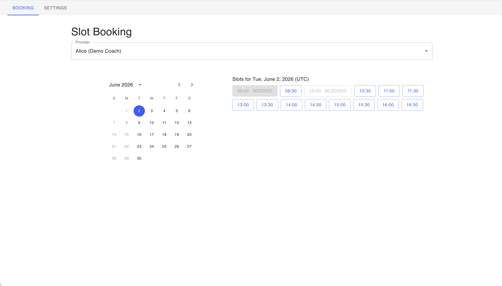
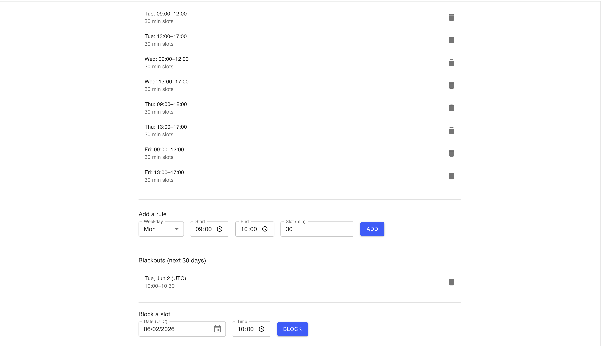

# slot-booking

Demo slot-booking app: NestJS + GraphQL backend, React + Apollo + MUI frontend, SQLite, in a pnpm monorepo.

## Screenshots

**Booking** — calendar + day slots with `BOOKED` / `BLOCKED` shown disabled alongside available ones:



**Settings** — weekly rules + per-slot blackouts admin:



## Prerequisites
- Node 20+ (`nvm use`)
- pnpm 9+ (`corepack enable && corepack prepare pnpm@9 --activate`)

## Install
```bash
pnpm install
```

## Run — local (Node)

```bash
pnpm seed   # creates apps/api/dev.sqlite with 1 provider + Mon-Fri rules + 2 pre-bookings
pnpm dev    # boots api (http://localhost:4000/graphql) + web (http://localhost:5173) together
```

## Run — Docker

```bash
docker compose up --build -d                       # builds + runs api (4000) + web (5173)
docker compose exec api node dist/src/seed.js      # seed inside the api container (once)
# open http://localhost:5173
docker compose down                                 # stop (use -v to drop the sqlite volume)
```

The SQLite file lives in a named `sqlite_data` volume mounted at `/data` in the api container. The web image is a static nginx build; `VITE_API_URL` is baked at build time and defaults to `http://localhost:4000/graphql` (the browser runs on the host, so it reaches the api via the host-exposed port).

## Test

```bash
pnpm test         # unit tests across workspaces (slot computation + bookings service)
pnpm test:int     # integration tests against in-memory SQLite via supertest
pnpm e2e          # playwright golden-path against api + web
```

## Routes

**Frontend** (web on `:5173`):

| Path | Page |
|---|---|
| `/` | Booking — provider select, month calendar, day's slots, booking dialog (booked/blocked slots are visible but disabled) |
| `/settings` | Availability admin — rules (Sun..Sat × time window × slot duration) + per-slot blackouts |

**Backend** (api on `:4000`):

| Method | Path | What |
|---|---|---|
| `POST` | `/graphql` | All API traffic — schema below |
| `GET`  | `/graphql` | Apollo Playground (dev only) |

GraphQL operations:

| Type | Name | Purpose |
|---|---|---|
| Query | `users` | List providers |
| Query | `slots(userId, from, to)` | All grid slots in the range with status (AVAILABLE / BOOKED / BLOCKED) |
| Query | `availabilityRules(userId)` | List the provider's weekly rules |
| Query | `blackoutSlots(userId, from, to)` | List the provider's blocked slots in a range |
| Mutation | `createBooking(input)` | Book a slot; typed errors (`SLOT_TAKEN`, `SLOT_NOT_IN_AVAILABILITY`, `SLOT_BLACKED_OUT`, `USER_NOT_FOUND`, `VALIDATION`) |
| Mutation | `createAvailability(input)` | Add a weekly rule; typed errors (`AVAILABILITY_OVERLAP`, `AVAILABILITY_INVALID`, `VALIDATION`) |
| Mutation | `deleteAvailability(id)` | Remove a rule by id |
| Mutation | `createBlackout(input)` | Block a specific slot; typed errors (`SLOT_TAKEN`, `SLOT_NOT_IN_AVAILABILITY`, `USER_NOT_FOUND`) |
| Mutation | `deleteBlackout(id)` | Un-block a slot |

## What's inside

- `apps/api` — NestJS 11, code-first GraphQL via `@nestjs/graphql` + Apollo, TypeORM + better-sqlite3.
  - Modules: `users`, `availability`, `slots`, `bookings`, plus `common` (errors + filter) and `database`.
  - Resolver → Service → Repository layering. Domain errors are typed and translated to GraphQL `extensions.code` by a single `@Catch()` filter.
  - `SlotService.computeAvailableSlots` is a pure function — that's the brain, and it carries the heaviest unit-test weight.
- `apps/web` — Vite + React 19, Apollo Client, MUI v6. Single screen: month calendar (left) + that day's slots (right). Days without availability are disabled.

## Tradeoffs / non-goals
- **No auth.** A real customer flow needs anti-abuse (rate-limits, magic links).
- **UTC only.** Provider TZ vs. customer TZ is real work and orthogonal to the architectural story.
- **Slots are computed, not stored.** Heavier reads, single source of truth. At scale, cache `availableSlots` or materialize with invalidation on booking writes.
- **Unique-index race protection works because slots are a fixed grid.** Overlapping or variable-length bookings need a range-exclusion constraint (Postgres `EXCLUDE USING gist`) or app-level locking.
- **`synchronize: true` on TypeORM.** Fine for a demo, never in production — use migrations instead.
- **No CANCEL endpoint.** Bookings, once confirmed, are not user-cancellable.
- **No auth on `/settings`.** Anyone with the URL can edit any provider's rules — demo-only.
- **Deleting an availability rule does not delete past bookings inside its window.** Bookings are contractual; schedule changes don't retroactively cancel them.
- **better-sqlite3 is synchronous.** Concurrent integration test exercises the unique-constraint path, which is the real safety net. Under Postgres with true parallelism, the constraint still does the work.
- **Blackouts must align to the rule grid.** Out-of-band partial blocks (e.g. 10:15-10:45 inside a 30-min grid) are not supported. No "block whole week" shortcut — one slot at a time. A race window exists between `createBooking` and `createBlackout` (no single DB constraint spans both); production would need an app-level lock or a unified slot-status table.
